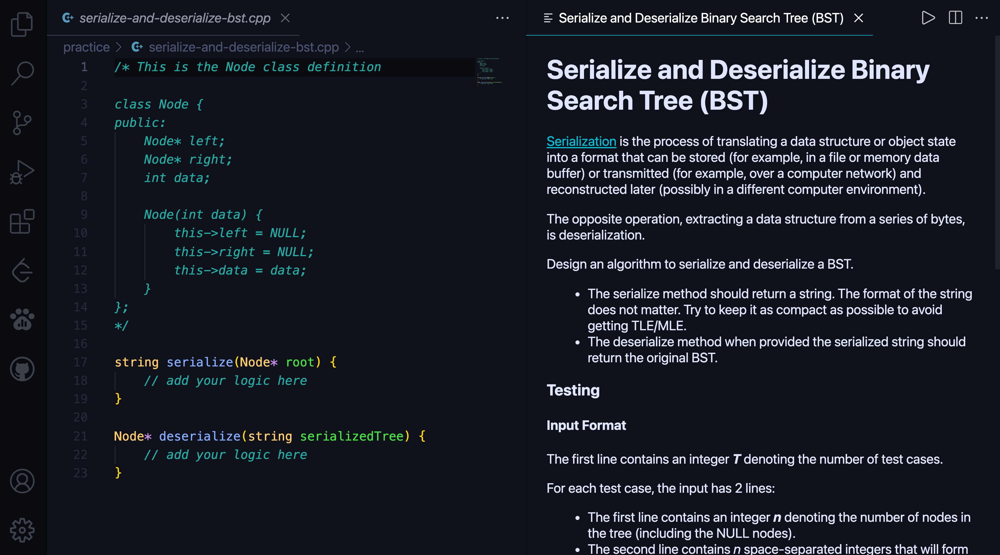

# VSCode-WorkAt

VSCode-WorkAt is an extension that lets you write code for [WorkAt.tech](https://workat.tech) in VSCode. Check it out on the [Marketplace](https://marketplace.visualstudio.com/items?itemName=AdityaPrakash.vscode-workat).

## Features

Choose a language from the dropdown menu and start writing your code. You can additionally access all of the topics, companies and lists made by WorkAt.tech.

## How to use

Press **Ctrl+Shift+P** (**Cmd+Shift+P** on macOS) to open the command pallete. Then select **Get Problems** from the list. This will start an interactive prompt, where you can choose between solving problems topics-wise, or company-wise, or get a list of curated problems. This feature will be expanded to be GUI-based (via Activity Bar) in the future.

## Known Issues

Currently, it is not possible to submit the code from within VSCode. This is due to a security concern. As an immediate work-around, when you click submit, your code will be copied to your clipboard, and you will automatically be redirected to the respective problem's page on [workAt](https://workat.tech).

## Release Notes

### 1.1.2

Updated `follow-redirects` to `v1.14.7`, which fixes a critical security vulnerability.

Check out the [Changelog](CHANGELOG.md) for more details.

## Credits

- [Aditya Prakash](https://adityaprakash.tech) - Author & Developer
- [WorkAt.tech Team](https://workat.tech) - For the platform & community. Helped me out with the API endpoints.
- [developomp](https://github.com/developomp) - Helping me out with my questions